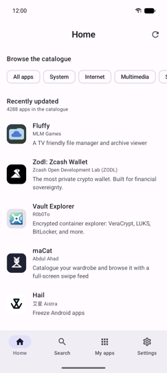
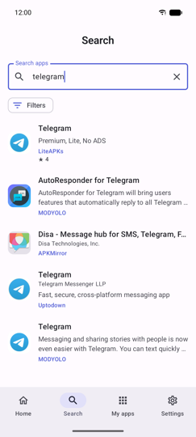
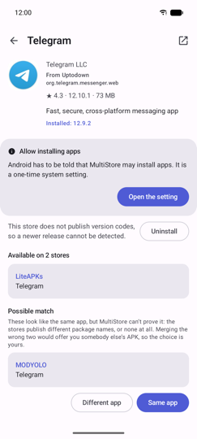

<div align="center">


<h1>MultiStore</h1>

<p><strong>One search across many Android app stores.</strong></p>

<p>
Search them all at once, compare what each one publishes for the same app, and install from the
source you choose, through the same verification pipeline every time.
</p>

<p>
<a href="https://github.com/FedeFluork/multistore/releases/latest"></a>
<a href="https://github.com/FedeFluork/multistore/releases"></a>


<a href="LICENSE"></a>
<a href="https://github.com/FedeFluork/multistore/actions/workflows/ci.yml"></a>
</p>

</div>

---

## Install

<div align="center">

### ⬇&nbsp; [Download the latest APK](https://github.com/FedeFluork/multistore/releases/latest)

</div>

1. Download the `.apk` from the [latest release](https://github.com/FedeFluork/multistore/releases/latest).
2. Open it. Android asks once whether MultiStore may install applications. That is the
   `REQUEST_INSTALL_PACKAGES` permission, which any app that installs other apps needs. If your
   device makes that setting hard to find, MultiStore has a shortcut straight to it.
3. That is all. From then on MultiStore offers **its own updates** the same way it offers everyone
   else's, from a signed index it verifies before applying.

**Requires Android 8.0 (API 26) or newer.**

### Verify what you downloaded

Every release is signed with the same key, and that key will not change. Android refuses an update
signed by a different one, so a mismatch is worth stopping for.

```sh
apksigner verify --print-certs multistore-<version>.apk
```

```
Signer #1 certificate SHA-256 digest:
1c55e627f183f0f3d0e16fc67b211f4f1bd7a7b228ee414c4a9e4eaa0da5d506
```

<div align="center">

&nbsp;

&nbsp;

</div>

---

## What it does

**One search, many sources.** A query fans out to every enabled store in parallel; results stream in
as each answers and are grouped into one row per app, with every store that has it listed
underneath. Nothing waits for the slowest source, and a store that fails or gets rate-limited is
named next to the results instead of silently vanishing.

**It says which one to trust.** Not every store is the same. Some publish a SHA-256 for each file,
some publish the package name, some redistribute modified builds. The app page reports what
verification was actually able to prove, and "verified" and "not contradicted" are different
sentences. Settings says what to expect from each source.

**It admits when it cannot be sure.** Stores disagree about package names, and some publish none at
all, so "the same app on two stores" often has to be inferred. Below a confidence threshold nothing
is merged silently: the second listing shows up as a *possible* match with the reason, and the
choice is yours.

**Seven checks before anything is installed.** Size, streamed SHA-256, archive read with `apksig`,
package-name match against the listing (a hard, non-bypassable block), signer comparison against the
already-installed certificate including v3 key rotation, anti-downgrade, and a record of what was
installed from where. The file that is verified and the file that is installed are the same bytes:
the hash is computed *while* writing into the install session, not before it.

**Split containers install properly.** XAPK, APKM and APKS bundles are opened, the right ABI and
density splits are chosen for the device, every language split is kept, and base plus splits go into
a single `PackageInstaller` session.

**Updates come from the store the app came from.** Changing publisher mid-life breaks the update at
the OS level, so each installed app remembers its own update channel. You can change it deliberately
and get warned about the signature conflict.

**Three ways to install.** The standard system confirmation always works; Shizuku and root, where
available, install silently. No feature *requires* a privileged channel. Where one is only
available with it, the interface says so.

**Everything stays on the device.** No telemetry, no accounts, no analytics. The diagnostics log is
off by default, lives locally, and is exported by you as a plain-text file you can read before
sending it anywhere.

**Five languages, light and dark.** English, Italian, French, Spanish and German, all complete or
the build fails. Every screen has a screenshot baseline in both themes, and each one is run through
the Accessibility Test Framework.

### What it is not

MultiStore does not host, mirror or rehost anything. It reads publicly reachable pages the way a
browser does, on requests a person has just made. It does not solve captchas, forge TLS fingerprints
or rotate addresses to get around a block. Where a download genuinely needs a human tap, you make
it. See [Anti-bot: the line](REFERENCE.md#anti-bot-the-line).

## Stores

The sources MultiStore reads today:

- **AN1**
- **APKCombo**
- **APKMirror**
- **APKMODY**
- **F-Droid**
- **LiteAPKs**
- **MODYOLO**
- **PDALIFE**
- **Uptodown**

This list grows as adapters are added, and each one can be switched off individually in Settings.
What each source publishes, how it is reached and the traps it sets are in
[REFERENCE.md](REFERENCE.md#the-stores), all of it measured against the live sites rather than read
off documentation.

## Building

```sh
export JAVA_HOME="/path/to/a/jdk-17-compatible-jdk"   # Android Studio's JBR works
./gradlew :app:installDebug
```

Requirements: JDK 17 bytecode target, Android SDK with `compileSdk 37`. The Gradle wrapper is
included.

| Variant | Command | Purpose |
|---|---|---|
| `debug` | `./gradlew :app:installDebug` | day-to-day development |
| `minified` | `./gradlew :app:installMinified` | release with R8, but installable. **Use this before trusting a library that resolves by name** |
| `release` | `tools/release.sh` | distribution artifact; unsigned unless `.secrets/keystore.properties` exists |

Full checks:

```sh
./gradlew build checkDependencyRules lint verifyRoborazziDebug
```

## Tests and guardrails

A set of executable guardrails enforces the rules the project will not bend on: no hardcoded strings
in any language, translation parity across all five, every settings field reachable from the UI *and*
actually drawn, both themes captured for every screen, no backup escape for private folders, and the
module dependency rules. They run offline in seconds.

A nightly canary runs the parsers against the real sites and opens an issue when a store changes
shape. It is deliberately non-blocking: it is neither offline nor deterministic, so it must not be
able to fail a build.

```sh
./gradlew :guardrails:test               # the guardrails
./gradlew checkDependencyRules           # module boundaries
./gradlew :store:apkmirror:canaryTest    # one adapter against the live site
```

## More detail

[**REFERENCE.md**](REFERENCE.md) covers the architecture, the module graph and its enforced
dependency rules, the verification pipeline step by step, the installer channels, split containers,
version selection, the signed remote-configuration channel, caching, the anti-bot boundary, and the
per-store notes.

## Contributing

Adding a store is a checklist that touches no core module: see
[REFERENCE.md § Adding a store](REFERENCE.md#adding-a-store). If you find yourself needing to change
`:core:*` to make an adapter fit, the contract in `:store:api` is incomplete: fix the contract, not
the caller.

## License

[GPL-3.0](LICENSE).
